# Welcome to Yves Signal's Book Frontend Projects

## Introduction
Hi there, I'm Julien, a fullstack developper apprentice, currently studying at O'clock 'til May 2022.
I welcome you to this modest project portfolio.
All these projects are made on my free time, so they do not contain any school intellectual materials.

For now on, I'm a lot onto [Front End Mentor](https://www.frontendmentor.io/home) that provides me a lot of challenging prototypes to craft.
I cared a lot crafting all of theses without any framework, for learning sake, and even if they are a lot perfectible, I'm quite pride of where I am at today.
Once I finish a project, I move on, so the state of my early prototypes reflect the mindset I had then and possibly a lack of knowledge I learnt, becomming the best iteration of myself.

All my stuff is acesible on GitHub and hosted with GitHub Pages, so you can play with it.

Enough talking, let's take a glimpse at what I produced !

## Front End Mentor Challenges

All projects are listed in the order I made them, so you can appreciate the road I walked along to this day.

1. [NFT Preview Card Component](https://julien-goletto.github.io/nft-preview-card-component-main/html/)
     - Starting with HTML et du CSS
    - [GitHub Repository](https://github.com/Julien-Goletto/Julien-Goletto.github.io/tree/main/nft-preview-card-component-main)
    

    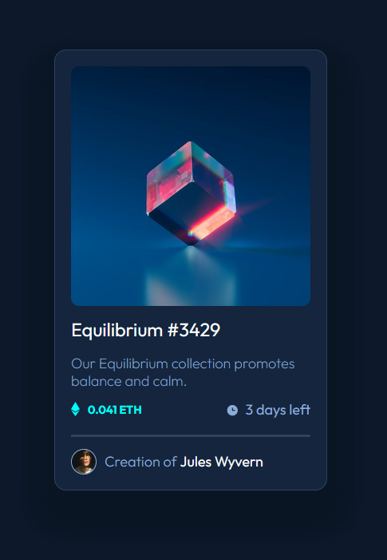
    

2. [Order Summary Content](https://julien-goletto.github.io/order-summary-component-main/html/)
    - Going on with HTML et CSS
    - [GitHub Repository](https://github.com/Julien-Goletto/Julien-Goletto.github.io/tree/main/order-summary-component-main)
    

    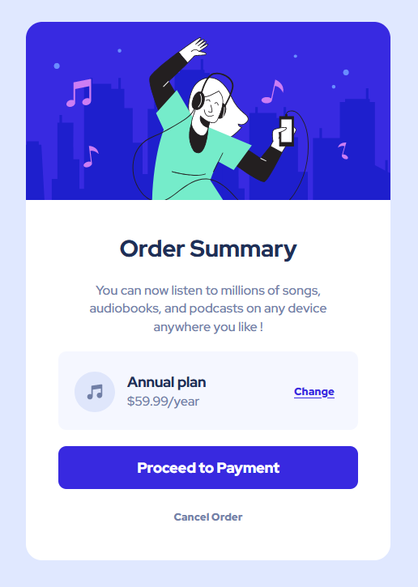
    

3. [3 Columns Preview Card](https://julien-goletto.github.io/3-column-preview-card-component-main/html/)
    - Still playing with HTML and CSS
    - [GitHub Repository](https://github.com/Julien-Goletto/Julien-Goletto.github.io/tree/main/3-column-preview-card-component-main)
    

    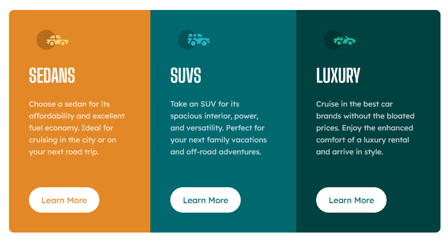
    

4. [Profile Card](https://github.com/Julien-Goletto/Julien-Goletto.github.io/tree/main/profile-card-component)
    - Focused on design
    - [GitHub Repository](https://github.com/Julien-Goletto/Julien-Goletto.github.io/tree/main/profile-card-component)
    

    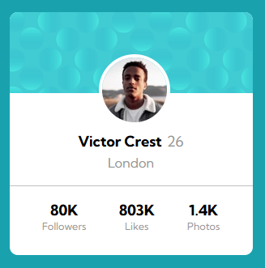
    

5. [Stats Preview Card](https://julien-goletto.github.io/stats-preview-card-component-main/html/)
    - Experimenting with background effects
    - [GitHub Repository](https://github.com/Julien-Goletto/Julien-Goletto.github.io/tree/main/stats-preview-card-component-main)
    

    
    

6. [Social Proof](https://julien-goletto.github.io/social-proof-section-master/html/)
    - Flexboxes and particular display rules everywhere & introducing media queries
    - [GitHub Repository](https://github.com/Julien-Goletto/Julien-Goletto.github.io/tree/main/social-proof-section-master)
    

    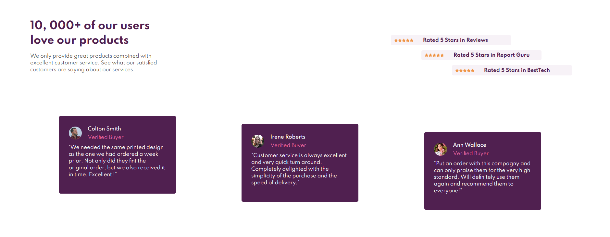
    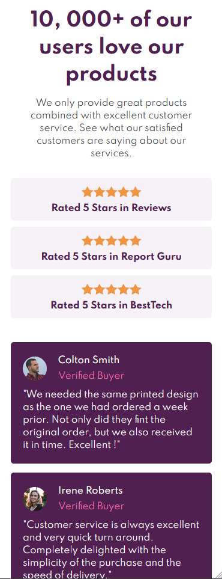
    

7. [Fylo Data Storage](https://julien-goletto.github.io/fylo-data-storage-component-master/html/)
    - Gorgeous design and tricks for the bar progression and legend
    - [GitHub Repository](https://github.com/Julien-Goletto/Julien-Goletto.github.io/tree/main/fylo-data-storage-component-master)
    

    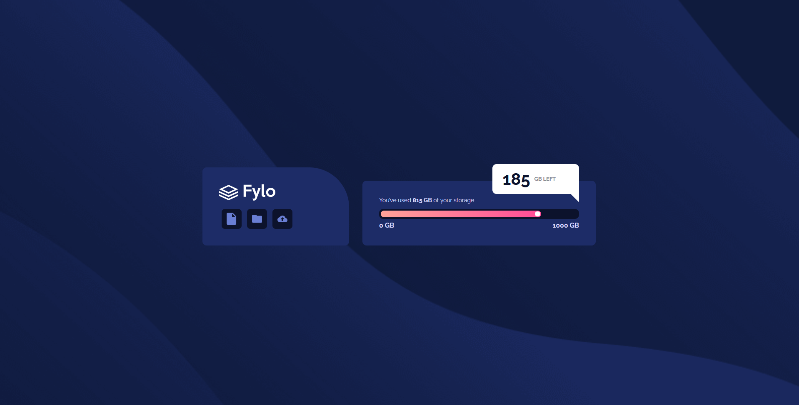
    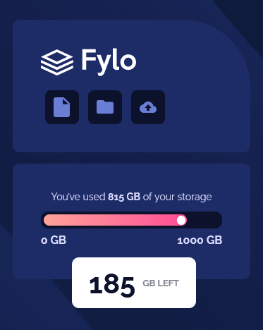
    

8. [Testimonial Grid](https://julien-goletto.github.io/testimonials-grid-section-main/html/)
    - Playing with CSS Grids is kinda funny AND VERY USEFULL
    - [GitHub Repository](https://github.com/Julien-Goletto/Julien-Goletto.github.io/tree/main/testimonials-grid-section-main)
    

    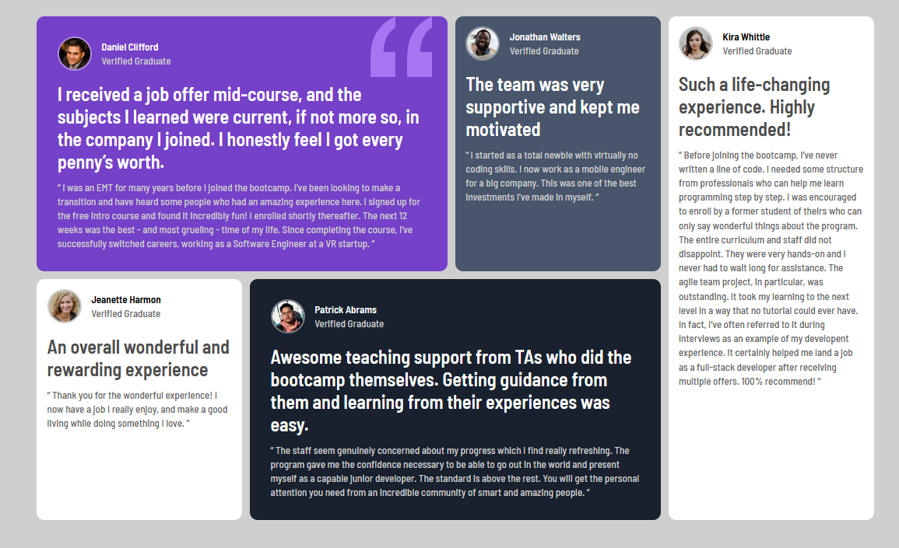
    
    

9. [Chat App Illustration](https://julien-goletto.github.io/chat-app-css-illustration-master/html/)
    - Did I mastered CSS tricks ? Nope, but I'm kinda proud of these ones.
    - [GitHub Repository](https://github.com/Julien-Goletto/Julien-Goletto.github.io/tree/main/chat-app-css-illustration-master)
    

    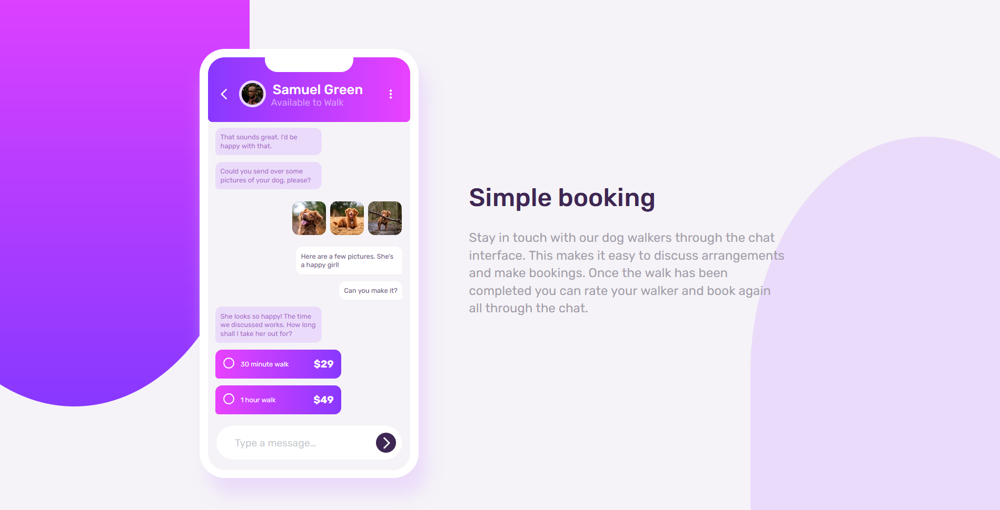
    
    

10. [Calculator App](https://julien-goletto.github.io/calculator-app/html/)
    - Introducing JS for theme swapping... and make it trully functionnal despite JS seems not to be adapted for precision calculations
    - [GitHub Repository](https://github.com/Julien-Goletto/Julien-Goletto.github.io/tree/main/calculator-app)
    

    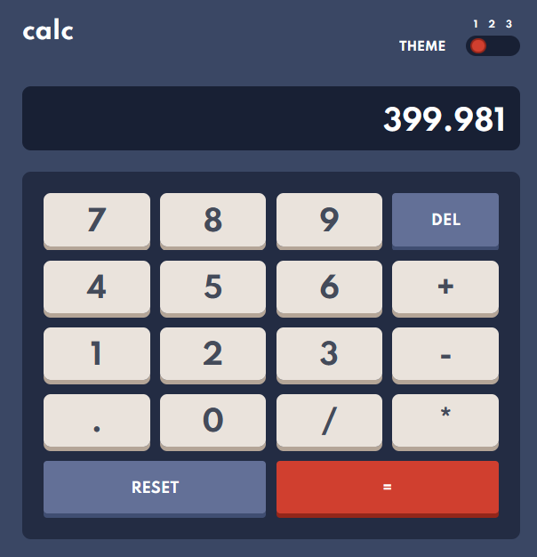
    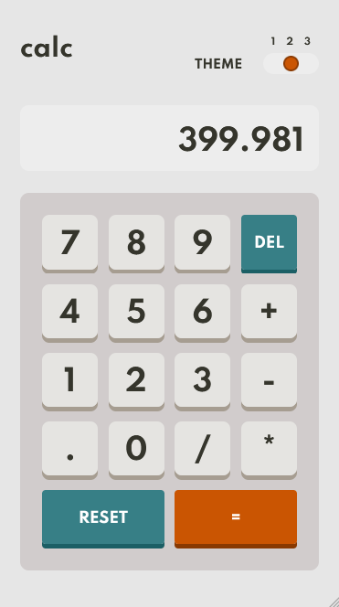
    

10. [Interactive Pricing Component](https://julien-goletto.github.io/interactive-pricing-component/html/)
    - Still playing with JS scripts... OMG this is freaking funny
    - [GitHub Repository](https://github.com/Julien-Goletto/Julien-Goletto.github.io/tree/main/interactive-pricing-component)
    

    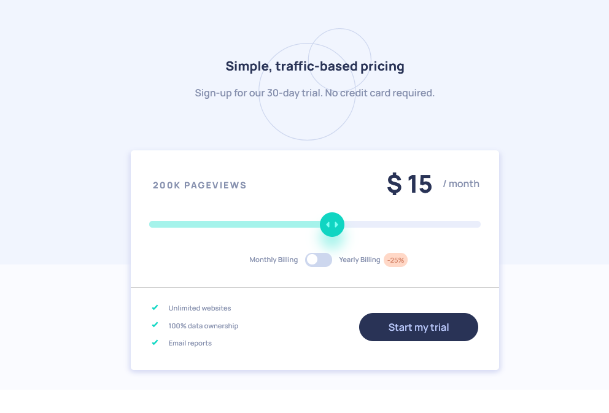
    
    
